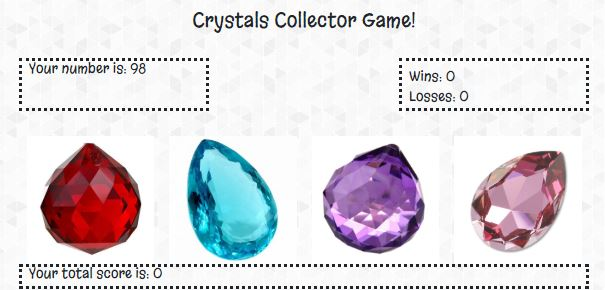

<h1>Crystals Collector Game</h1>

Click the crystals until your score matches the number you're given in the beginning of each game.  

Release 1.1 MVP:

The game is deployed to https://amandalragone.github.io/unit-4-game/.

It starts when a random value between 19 and 120 is selected by the computer and displayed in the "Your number is" section.

The goal will be clicking the crystals on the screen and adding their values until the total displayed under the "Your total score is" section matches the value selected by the computer.

If the player is able to match the exact same value, he/she wins and the game starts over. The amount of wins will be displayed right next to "Wins".

If the player score goes above the value selected by the computer, the player loses and the value displayed under "Losses" increases by 1.

<h2>MVP</h2>
Phase One: Select five random numbers and populate them in the console.
Phase Two: Create code that allows users to add the appropriate number to their score.
Phase Three: Style interface.
Phase Four: Link working game to the interface and populate number assigned, score and wins/losses as the user plays the game.

<h2>Project Management</h2>
[Project Board](https://github.com/amandalragone/unit-4-game/projects/2)

<h2>How to play this game</h2>
1. Go to https://amandalragone.github.io/unit-4-game/.
2. Click a crystal. You'll see your score has gone up by the value assigned to that crystal.
3. Keep clicking on the crystals (one at a time) until your score matches the number displayed under the "Your number is" section.
